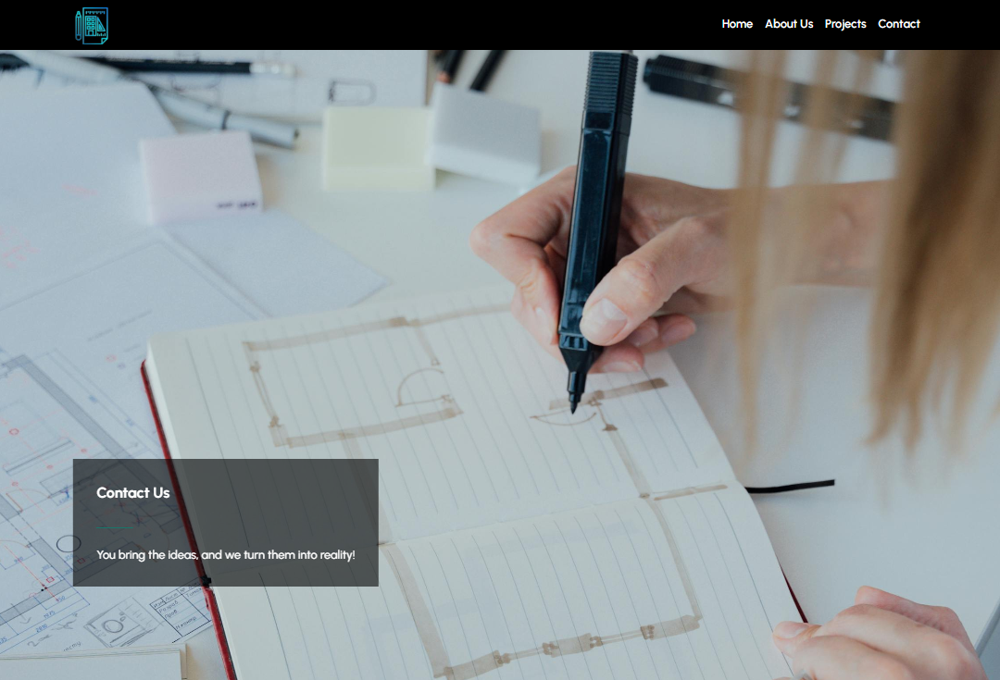
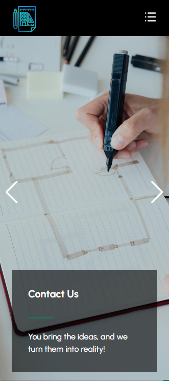

# Construction company website / Next.js

## [Check it live here](https://construction-web1.netlify.app/)




A website for a construction company made with React 15.0.3

### Installing

Clone the Repository and run

```
npm install
npm start
```

## Deployment

First, run the development server:

```bash
npm run dev
# or
yarn dev
# or
pnpm dev
# or
bun dev
```

To deploy simply run

```
npm run build
```

## Built With

- [Next.js](https://nextjs.org/)
- [React](https://react.dev/)
- [React Dom](https://react.dev/reference/react-dom)
- [TailwindCSS](https://tailwindcss.com/)
- [Swiper](https://swiperjs.com/)
- [Light Gallery](https://www.lightgalleryjs.com/)
